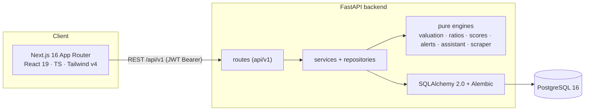

# PSX Value Investor Platform

> Pakistan's first AI-assisted fundamental-analysis platform — built to answer one
> question for every listed company: **"What is this actually worth, and should I
> buy it today?"**

The platform ingests company financials, computes intrinsic value with seven
independent valuation models, grades quality with institutional scorecards
(Piotroski F-Score, Altman Z-Score, Magic Formula), surfaces buy/sell zones and
plain-language recommendations, and lets signed-in users keep a watchlist, a
tracked portfolio, and valuation-alert subscriptions.

It is a **monorepo** — a Next.js frontend, a FastAPI backend, a PostgreSQL
database, and Docker-based infrastructure. See
[PROJECT_ROADMAP.md](PROJECT_ROADMAP.md) for the full product vision and
engineering standards.

> **Disclaimer:** For informational and educational purposes only — nothing here
> is financial advice. All bundled figures are illustrative development data.

---

## Table of contents

- [What the platform does](#what-the-platform-does)
- [Architecture](#architecture)
- [Tech stack](#tech-stack)
- [Repository layout](#repository-layout)
- [Prerequisites](#prerequisites)
- [Quick start](#quick-start)
- [Common commands](#common-commands)
- [API reference](#api-reference)
- [Data model](#data-model)
- [Domain engines](#domain-engines)
- [Testing & quality gates](#testing--quality-gates)
- [Deployment](#deployment)
- [Project status](#project-status)

---

## What the platform does

**Public (no account needed)**

- **Company explorer** — searchable, sortable directory of PSX companies with full profiles.
- **Financial statements** — income statement, balance sheet, and cash-flow, annual & quarterly.
- **Ratio engine** — profitability, returns, liquidity, leverage, efficiency, growth, and valuation multiples.
- **Interactive charts** — historical trends for revenue, earnings, ROE/ROIC, EPS, book value, FCF, and dividends.
- **Intrinsic value** — a blended fair value from seven models (DCF, Graham, historical/industry P/E, EV/EBITDA, residual income, dividend discount).
- **Buy & sell zones** — margin-of-safety price bands (Strong Buy → Strong Sell).
- **Explainable recommendation** — a BUY/HOLD/SELL call with the factors behind it.
- **AI scores** — Piotroski F-Score, Altman Z-Score, Magic Formula, plus Financial-Health / Buffett / Graham / Quality composites.
- **Alert signals** — conditions that currently hold (undervaluation, ROIC/debt/earnings/dividend changes, rating flips).
- **AI assistant** — a deterministic, transparent Q&A that answers "Should I buy X?" from the platform's own outputs.
- **Stock screener** — filter the universe by ROE, ROIC, P/E, yield, leverage, growth, positive FCF, and sector.
- **Data quality & provenance** — freshness plus per-figure source traceability.
- **Portfolio analyzer** — paste holdings for gain/loss, margin of safety, expected CAGR, and a health score (kept in the browser when logged out).

**For signed-in users (self-contained JWT auth)**

- **Watchlist** — track companies with live valuation context.
- **Persisted portfolio** — positions saved to your account and analysed server-side.
- **Alert subscriptions** — subscribe to a company's live valuation signals.

---

## Architecture



- **Layered backend**: `routes → services → repositories → models`, with all
  business math isolated in **pure, dependency-free engines** (`app/valuation`,
  `app/calculations`, `app/scores`, `app/alerts`, `app/assistant`, `app/scraper`)
  that are unit-tested in isolation.
- **Self-contained auth**: FastAPI issues HS256 JWTs, passwords are hashed with
  bcrypt, and every user-scoped resource enforces ownership — no external identity
  provider.
- **Data pipeline**: an offline-file ingestion path normalizes, validates, and
  idempotently upserts financials with full provenance and a job audit trail.

---

## Tech stack

| Layer     | Choice                                                                    |
| --------- | ------------------------------------------------------------------------- |
| Frontend  | Next.js 16 (App Router), React 19, TypeScript (strict), Tailwind CSS v4    |
| Charts    | lightweight-charts v5                                                      |
| Backend   | FastAPI, Pydantic v2, SQLAlchemy 2.0, Alembic (Python 3.12)               |
| Database  | PostgreSQL 16 (psycopg v3 driver)                                          |
| Auth      | Self-contained JWT (PyJWT, HS256) + bcrypt password hashing                |
| Tooling   | Ruff, Black, mypy, pytest (backend) · ESLint, Prettier, tsc (frontend)     |
| CI/CD     | GitHub Actions                                                            |
| Hosting   | Vercel (frontend), Render (backend), Supabase/Postgres (database)          |

---

## Repository layout

```text
frontend/                 # Next.js 16 app (App Router)
  app/                    # routes: /, /companies, /companies/[symbol], /screener,
                          #         /watchlist, /portfolio, /login, /register
  components/             # server & client React components (views + widgets)
  lib/                    # api client, auth store, types, formatters
backend/                  # FastAPI service
  app/
    api/v1/routes/        # HTTP endpoints (health, auth, companies, search,
                          #   screener, portfolio, watchlist, alerts)
    core/                 # config, database, security (JWT/bcrypt), logging
    models/               # SQLAlchemy ORM models
    schemas/              # Pydantic request/response models
    repositories/         # data-access layer
    services/             # orchestration layer
    valuation/            # DCF, Graham, multiples, zones, recommendation (pure)
    calculations/         # financial ratios & portfolio math (pure)
    scores/               # Piotroski, Altman-Z, Magic Formula, composites (pure)
    alerts/               # signal-detection rules (pure)
    assistant/            # intent classifier + narrative composer (pure)
    scraper/              # normalize / validate / parse ingestion pipeline (pure)
  alembic/versions/       # 0001_initial → 0004_auth migrations
  scripts/                # seed, generate_financials, ingest
  tests/                  # pytest suites (unit + endpoint), ~98% coverage
database/                 # SQL migrations, seeds, policy notes
infra/                    # Docker Compose + env templates
docs/adr/                 # architecture decision records
```

---

## Prerequisites

- **Node.js** ≥ 20 (tested on 24) and npm ≥ 10
- **Docker** + Docker Compose (runs Postgres and the backend locally)
- **Python** 3.12 (only if you want to run the backend outside Docker)
- **Git**

---

## Quick start

### 1. Clone and configure

```bash
git clone <repo-url> psx-value-investor-platform
cd psx-value-investor-platform
cp infra/.env.example infra/.env
cp backend/.env.example backend/.env
cp frontend/.env.example frontend/.env.local
```

Key environment variables:

| Variable                   | Where            | Purpose                                             |
| -------------------------- | ---------------- | --------------------------------------------------- |
| `DATABASE_URL`             | backend / infra  | `postgresql+psycopg://…` connection string          |
| `SECRET_KEY`               | backend          | Signs JWTs — **set a strong 32+ byte value in prod** |
| `CORS_ORIGINS`             | backend          | Allow-list of trusted frontend origins              |
| `NEXT_PUBLIC_API_BASE_URL` | frontend         | Defaults to `http://localhost:8000/api/v1`          |

### 2. Run the backend + database with Docker

```bash
docker compose -f infra/docker-compose.yml up --build
```

- API:      http://localhost:8000  (OpenAPI docs at `/docs`, ReDoc at `/redoc`)
- Health:   http://localhost:8000/api/v1/health
- Postgres: localhost:5432

### 3. Apply migrations and seed sample data

Run inside the backend container (or a local venv with `DATABASE_URL` set):

```bash
alembic upgrade head          # create all tables (0001 → 0004)
python -m scripts.seed        # seed sample companies + financials
python -m scripts.ingest      # (optional) run the ingestion pipeline demo
```

### 4. Run the frontend

```bash
cd frontend
npm install
npm run dev
```

- Web app: http://localhost:3000

Open a company (e.g. `/companies/ENGRO`), then register at `/register` to unlock
the watchlist, persisted portfolio, and alert subscriptions.

### 5. Run the backend locally without Docker (optional)

```bash
cd backend
python -m venv .venv
# Windows: .venv\Scripts\activate  |  Unix: source .venv/bin/activate
pip install -e ".[dev]"
alembic upgrade head
uvicorn app.main:app --reload
```

---

## Common commands

### Frontend (`frontend/`)

```bash
npm run dev        # start dev server
npm run build      # production build
npm run lint       # ESLint
npm run typecheck  # tsc --noEmit
npm run format     # Prettier write
```

### Backend (`backend/`)

```bash
ruff check .           # lint
black .                # format
mypy app               # type check
pytest --cov=app       # tests + coverage
alembic upgrade head   # apply migrations
python -m scripts.seed # seed sample data
```

---

## API reference

All endpoints are served under the `/api/v1` prefix. Interactive docs live at
`/docs` (Swagger UI) and `/redoc`. Authenticated routes expect an
`Authorization: Bearer <jwt>` header.

**Health**

| Method | Path       | Description        |
| ------ | ---------- | ------------------ |
| GET    | `/health`  | Liveness/readiness |

**Auth** (self-contained JWT)

| Method | Path             | Description                          |
| ------ | ---------------- | ------------------------------------ |
| POST   | `/auth/register` | Create an account, returns a token   |
| POST   | `/auth/login`    | Exchange credentials for a token     |
| GET    | `/auth/me`       | Current user profile (authenticated) |

**Companies & analysis** (public)

| Method | Path                                   | Description                                  |
| ------ | -------------------------------------- | -------------------------------------------- |
| GET    | `/companies`                           | Paginated, sortable, filterable directory    |
| GET    | `/search`                              | Quick symbol/name search                     |
| GET    | `/screener`                            | Filter the universe by fundamentals          |
| GET    | `/companies/{symbol}`                  | Company profile                              |
| GET    | `/companies/{symbol}/financials`       | Income / balance / cash-flow (annual/qtr)    |
| GET    | `/companies/{symbol}/ratios`           | Financial ratio set                          |
| GET    | `/companies/{symbol}/history`          | Historical metric series (charts)            |
| GET    | `/companies/{symbol}/valuation`        | Blended intrinsic value (7 models)           |
| GET    | `/companies/{symbol}/zones`            | Buy/sell margin-of-safety bands              |
| GET    | `/companies/{symbol}/recommendation`   | Explainable BUY/HOLD/SELL                    |
| GET    | `/companies/{symbol}/scores`           | Piotroski / Altman-Z / Magic / composites    |
| GET    | `/companies/{symbol}/alerts`           | Currently-firing alert signals               |
| GET    | `/companies/{symbol}/data-quality`     | Freshness + source provenance                |
| POST   | `/companies/{symbol}/assistant`        | Ask a question about the company             |
| POST   | `/portfolio/analyze`                   | Stateless portfolio analysis                 |

**User resources** (authenticated, per-user scoped)

| Method | Path                    | Description                          |
| ------ | ----------------------- | ------------------------------------ |
| GET    | `/watchlist`            | List watchlist (enriched)            |
| POST   | `/watchlist`            | Add a company                        |
| DELETE | `/watchlist/{symbol}`   | Remove a company                     |
| GET    | `/portfolio`            | Persisted portfolio analysis         |
| POST   | `/portfolio`            | Add/update a position (upsert)       |
| DELETE | `/portfolio/{symbol}`   | Remove a position                    |
| GET    | `/alerts`               | List alert subscriptions (enriched)  |
| POST   | `/alerts`               | Subscribe to a company's signals     |
| DELETE | `/alerts/{symbol}`      | Unsubscribe                          |

---

## Data model

PostgreSQL schema, managed by Alembic migrations `0001_initial` → `0004_auth`.

| Table                  | Purpose                                                       |
| ---------------------- | ------------------------------------------------------------- |
| `sectors`              | Industry/sector reference data                                |
| `companies`            | Listed-company profiles                                       |
| `financial_statements` | Annual & quarterly income/balance/cash-flow figures           |
| `ingestion_jobs`       | Audit trail for each pipeline run                             |
| `data_sources`         | Append-only provenance per figure (source URL, page, checksum) |
| `users`                | Accounts (email, bcrypt hash, profile)                         |
| `watchlist_items`      | User ↔ company watchlist (unique per user/symbol)             |
| `portfolio_positions`  | User holdings (quantity, average cost)                        |
| `alert_subscriptions`  | User ↔ company alert subscriptions                            |

---

## Domain engines

All financial logic lives in pure, framework-free modules that are unit-tested in
isolation (~100% coverage) and reused by the service layer:

| Module              | Produces                                                                 |
| ------------------- | ------------------------------------------------------------------------ |
| `app/valuation`     | DCF, Graham, historical/industry P/E, EV/EBITDA, residual-income and dividend-discount values; a weighted intrinsic value; buy/sell zones; explainable recommendation |
| `app/calculations`  | Financial ratios (profitability, returns, liquidity, leverage, growth) and portfolio math (margin of safety, expected CAGR, health score) |
| `app/scores`        | Piotroski F-Score, Altman Z-Score, Magic Formula, and Financial-Health / Buffett / Graham / Quality composites |
| `app/alerts`        | Signal detectors (valuation, ROIC/debt/earnings/dividend changes, rating flips) |
| `app/assistant`     | Keyword intent classifier + deterministic narrative composer             |
| `app/scraper`       | Ingestion pipeline: normalize → validate → parse, with provenance         |

---

## Testing & quality gates

Every change ships green on both stacks.

- **Backend** — `ruff check .`, `black --check .`, `mypy app`, and
  `pytest --cov=app` (≥ 80% enforced; currently ~98%). Domain engines are covered
  by focused unit tests; endpoints by integration tests against an in-memory DB.
- **Frontend** — `npm run lint`, `npm run typecheck`, and `npm run build`.
- **CI/CD** — GitHub Actions runs the full matrix on every pull request.

---

## Deployment

- Configuration is 12-factor: everything comes from environment variables and is
  validated at boot. Only `.env.example` templates are committed — never real secrets.
- **Frontend** deploys to **Vercel**; set `NEXT_PUBLIC_API_BASE_URL` to the API origin.
- **Backend** deploys to **Render** (Docker image); set `DATABASE_URL`, `SECRET_KEY`
  (strong, 32+ bytes), and `CORS_ORIGINS`. Run `alembic upgrade head` on release.
- **Database** is **PostgreSQL** (Supabase or any managed Postgres).

Environments used: `development`, `staging`, and `production`.

---

## Project status

The full product roadmap (Phases 1–13) is implemented and validated end-to-end,
plus three post-roadmap tracks:

- ✅ **AI scoring suite** — Piotroski, Altman-Z, Magic Formula, and quality composites.
- ✅ **Data pipeline** — normalize/validate/ingest with provenance and job auditing.
- ✅ **Self-contained JWT auth** — accounts, watchlists, persisted portfolios, and alert subscriptions.

Public analysis works without an account; signing in adds per-user persistence.

---

## Contributing

See [CONTRIBUTING.md](CONTRIBUTING.md). Every change ships via pull request with
green lint, type-check, and tests.

## License

[MIT](LICENSE)

---

> **Disclaimer:** This platform is for informational and educational purposes only
> and does not constitute financial advice. Bundled data is illustrative development
> data and must not be used for investment decisions.
